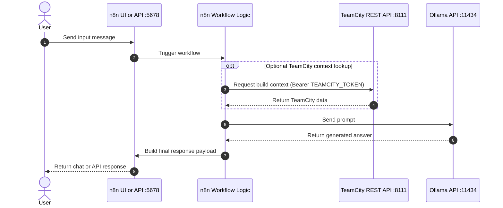
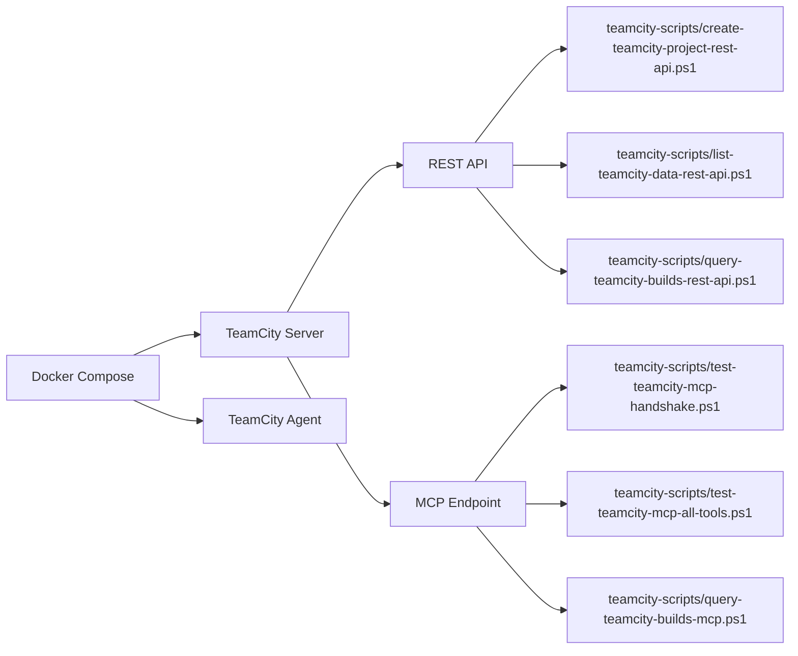
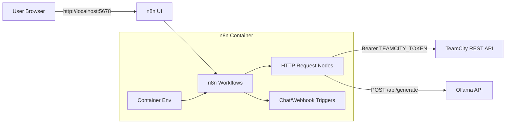
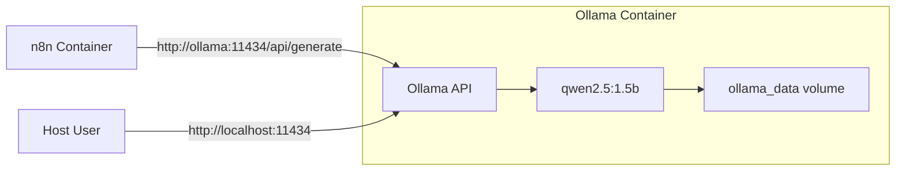

# TeamCity + n8n Docker Lab

Local Docker Compose lab for TeamCity (REST + MCP test flows), n8n (UI + chat/webhooks), and Ollama.

## Table of Contents

- [Architecture Overview](#architecture-overview)
- [1. TeamCity](#1-teamcity)
  - [1.1 Scope](#11-scope)
  - [1.2 Architecture](#12-architecture)
  - [1.3 Prerequisites](#13-prerequisites)
  - [1.4 Configuration](#14-configuration)
  - [1.5 First Start](#15-first-start)
  - [1.6 Token Setup](#16-token-setup)
  - [1.7 Agent Authorization](#17-agent-authorization)
  - [1.8 Scripts](#18-scripts)
  - [1.9 Reports](#19-reports)
  - [1.10 MCP Raw Data](#110-mcp-raw-data)
  - [1.11 Test Flow](#111-test-flow)
  - [1.12 Persistence](#112-persistence)
  - [1.13 Commands](#113-commands)
  - [1.14 Troubleshooting](#114-troubleshooting)
    - [1.14.6 PowerShell Scripts Blocked](#1146-powershell-scripts-blocked)
- [2. n8n](#2-n8n)
  - [2.1 Scope](#21-scope)
  - [2.2 Architecture](#22-architecture)
  - [2.3 Configuration](#23-configuration)
  - [2.4 First Start](#24-first-start)
  - [2.5 Persistence](#25-persistence)
  - [2.6 Commands](#26-commands)
  - [2.7 Troubleshooting](#27-troubleshooting)
  - [2.8 Planned Implementation: Custom Chat via Webhook API](#28-planned-implementation-custom-chat-via-webhook-api)
- [3. Ollama](#3-ollama)
  - [3.1 Scope](#31-scope)
  - [3.2 Architecture](#32-architecture)
  - [3.3 Configuration](#33-configuration)
  - [3.4 First Start](#34-first-start)
  - [3.5 Persistence](#35-persistence)
  - [3.6 Commands](#36-commands)
  - [3.7 Troubleshooting](#37-troubleshooting)
  - [3.8 Step-by-Step Setup](#38-step-by-step-setup)
- [4. Repository](#4-repository)
  - [4.1 Contents and Structure](#41-contents-and-structure)
  - [4.2 Platform Compatibility](#42-platform-compatibility)
  - [4.3 GitHub Notes](#43-github-notes)
  - [4.4 Legal](#44-legal)

## Architecture Overview

End-to-end runtime flow for a single user request in n8n.



Chronological flow summary:

1. User sends input into the n8n chat or webhook trigger.
2. The workflow logic processes the request.
3. Optional TeamCity REST call for build context (3a) and the Ollama prompt (3b).
4. Ollama returns the generated answer.
5. The response formatter builds the final payload.
6. The response is returned to the user.

## 1. TeamCity

## 1.1 Scope

This section covers TeamCity in this lab:

- local TeamCity server in Docker
- local TeamCity agent in Docker
- REST API testing
- MCP endpoint testing and tool calls
- build logs and report files

## 1.2 Architecture



Containers:

- teamcity-server
- teamcity-agent

## 1.3 Prerequisites

- Docker Desktop is running
- Docker Compose v2 is available
- PowerShell 7 as `pwsh`
- TeamCity initial setup completed once in browser

## 1.4 Configuration

Relevant values in `.env`:

```env
TEAMCITY_HTTP_PORT=8111
TEAMCITY_BASE_URL=http://localhost:8111
TEAMCITY_REPORT_DIR=reports
TEAMCITY_TOKEN=
```

Meaning:

- `TEAMCITY_HTTP_PORT`: published TeamCity UI port
- `TEAMCITY_BASE_URL`: default base URL for scripts
- `TEAMCITY_REPORT_DIR`: target directory for reports
- `TEAMCITY_TOKEN`: personal access token for REST/MCP scripts

## 1.5 First Start

```powershell
docker compose up -d --build
```

Open TeamCity:

- http://localhost:8111

Then complete the TeamCity startup wizard once.

## 1.6 Token Setup

1. Open TeamCity in browser.
2. Open your user profile.
3. Create an access token.
4. Put the token into `.env` as `TEAMCITY_TOKEN`.

## 1.7 Agent Authorization

After first startup, the agent is often `Unauthorized`.

UI path:

1. TeamCity -> Agents -> Unauthorized.
2. Select `docker-agent-01`.
3. Click Authorize.

REST path:

```powershell
Invoke-RestMethod `
  -Method Put `
  -Uri "http://localhost:8111/app/rest/agents/name:docker-agent-01/authorized" `
  -Headers @{ Authorization = "Bearer <TOKEN>"; "Content-Type" = "text/plain" } `
  -Body "true"
```

## 1.8 Scripts

Script overview in `teamcity-scripts/`:

- `create-teamcity-project-rest-api.ps1`: create demo projects and build configs
- `list-teamcity-data-rest-api.ps1`: list projects/buildTypes/queue
- `query-teamcity-builds-rest-api.ps1`: query builds/logs/tests/artifacts/agents via REST
- `query-teamcity-builds-mcp.ps1`: query build data via MCP JSON-RPC
- `test-teamcity-direct-api-variants.ps1`: test direct REST variants
- `test-teamcity-mcp-handshake.ps1`: test MCP handshake
- `test-teamcity-mcp-all-tools.ps1`: discover and call MCP tools
- `read-teamcity-build-logs-rest.ps1`: fetch build logs via REST
- `read-teamcity-build-logs-mcp.ps1`: fetch build logs via MCP

## 1.9 Reports

Default output under `reports/`:

- `teamcity-direct-api-variants-<variant>-*.json`
- `teamcity-mcp-all-tools-*.json`
- `tc-builds-query-rest-api-*.json`
- `tc-builds-query-mcp-*.json`

## 1.10 MCP Raw Data

Important fields in MCP report files:

- Request: `requestHeaders`, `requestBody`
- Response: `responseHeaders`, `responseBodyRaw`

Note: escaped JSON such as `\"` or `\n` is normal in persisted JSON files.

## 1.11 Test Flow

1. Start the stack.
2. Create demo data.
3. Verify data and queue.
4. Run MCP handshake.
5. Test REST variants.
6. Run REST and MCP build queries.
7. Check reports in `reports/`.

Examples:

```powershell
pwsh ./teamcity-scripts/create-teamcity-project-rest-api.ps1
pwsh ./teamcity-scripts/list-teamcity-data-rest-api.ps1
pwsh ./teamcity-scripts/test-teamcity-mcp-handshake.ps1
pwsh ./teamcity-scripts/test-teamcity-direct-api-variants.ps1 -Variant all
pwsh ./teamcity-scripts/query-teamcity-builds-rest-api.ps1
pwsh ./teamcity-scripts/query-teamcity-builds-mcp.ps1
```

## 1.12 Persistence

Persistent volumes:

- `teamcity_data`
- `teamcity_logs`
- `agent_conf`
- `agent_work`
- `agent_temp`
- `agent_system`

Full clean reset:

```powershell
docker compose down -v --remove-orphans
docker compose up -d --build
```

## 1.13 Commands

Start:

```powershell
docker compose up -d --build
```

Status:

```powershell
docker compose ps
```

Logs:

```powershell
docker compose logs -f teamcity-server
docker compose logs --tail=120 teamcity-agent
```

Stop:

```powershell
docker compose down
```

## 1.14 Troubleshooting

### 1.14.1 401 Unauthorized

- Token is missing/invalid/expired
- update `TEAMCITY_TOKEN` in `.env`

### 1.14.2 404 on MCP paths

- MCP plugin is not active or path is wrong
- check plugin status in TeamCity

### 1.14.3 405 on `/app/mcp`

- endpoint exists, but method is not allowed for that request

### 1.14.4 Agent connected but builds do not run

- agent is `Unauthorized`
- authorize agent in TeamCity (see 1.7)

### 1.14.5 TeamCity not reachable

```powershell
docker compose ps
docker compose logs --tail=120 teamcity-server
```

Check port in `.env`:

- `TEAMCITY_HTTP_PORT`

### 1.14.6 PowerShell Scripts Blocked

Error pattern:

- `Script execution is disabled on this system`

One-time run (recommended for quick test):

```powershell
powershell -ExecutionPolicy Bypass -File .\teamcity-scripts\create-teamcity-project-rest-api.ps1
```

Persistent for current user:

```powershell
Set-ExecutionPolicy -Scope CurrentUser -ExecutionPolicy RemoteSigned
```

Then open a new PowerShell session and run normally:

```powershell
.\teamcity-scripts\create-teamcity-project-rest-api.ps1
```

Optional if file is still blocked:

```powershell
Unblock-File .\teamcity-scripts\create-teamcity-project-rest-api.ps1
```

## 2. n8n

## 2.1 Scope

This section covers n8n in this lab:

- local n8n in Docker
- n8n web UI
- local webhook URL configuration
- operation and troubleshooting via Docker logs

## 2.2 Architecture



Container:

- `n8n`

Image build:

- `docker/n8n/Dockerfile`

Compose service:

- `n8n` in `docker-compose.yml`

## 2.3 Configuration

Relevant values in `.env`:

```env
N8N_HTTP_PORT=5678
N8N_BASE_URL=http://localhost:5678
N8N_HOST=localhost
N8N_PROTOCOL=http
N8N_TIMEZONE=Europe/Berlin
N8N_WEBHOOK_URL=http://localhost:5678/
TEAMCITY_TOKEN=
N8N_BLOCK_ENV_ACCESS_IN_NODE=false
N8N_RESTRICT_FILE_ACCESS_TO=/data/n8n-exports
TEAMCITY_AI_STRUCTURE_PATH=/data/n8n-exports/teamcity/structure.json
```

Meaning:

- `N8N_HTTP_PORT`: published host port
- `N8N_BASE_URL`: browser base URL
- `N8N_HOST`: hostname for generated links
- `N8N_PROTOCOL`: protocol (usually `http` locally)
- `N8N_TIMEZONE`: timezone
- `N8N_WEBHOOK_URL`: base for webhook URLs
- `TEAMCITY_TOKEN`: TeamCity PAT for API calls from n8n workflows
- `N8N_BLOCK_ENV_ACCESS_IN_NODE`: must be `false` in this lab if nodes access `$env`
- `N8N_RESTRICT_FILE_ACCESS_TO`: allowed paths for file read/write nodes
- `TEAMCITY_AI_STRUCTURE_PATH`: target file path for structure snapshots in workflow `01_TC_Structure_Sync`

Token behavior:

- `.env` values are not copied into workflow JSON during import.
- n8n reads `TEAMCITY_TOKEN` as container env on start/recreate.
- after changing `TEAMCITY_TOKEN`, recreate n8n or old value stays active.

## 2.4 First Start

Open n8n:

- http://localhost:5678

Create the owner account on first open.

## 2.5 Persistence

Persistent volume:

- `n8n_data`

Additional bind mount for local file snapshots:

- `./data/n8n-exports:/data/n8n-exports`

Full clean reset:

```powershell
docker compose down -v --remove-orphans
docker compose up -d --build
```

## 2.6 Commands

n8n logs:

```powershell
docker compose logs -f n8n
```

Rebuild/start n8n:

```powershell
docker compose up -d --build n8n
```

Check port mapping:

```powershell
docker compose port n8n 5678
```

## 2.7 Troubleshooting

### 2.7.1 n8n not reachable

```powershell
docker compose ps
docker compose logs --tail=120 n8n
```

Check in `.env`:

- `N8N_HTTP_PORT`

### 2.7.2 Webhook URL wrong

- set/check `N8N_WEBHOOK_URL` in `.env`
- restart n8n

```powershell
docker compose up -d --build n8n
```

### 2.7.3 TeamCity token changed but n8n still uses old value

- update `TEAMCITY_TOKEN` in `.env` first
- recreate n8n container (no build required)

```powershell
docker compose up -d --force-recreate n8n
```

Note:

- if workflow uses `$env.TEAMCITY_TOKEN`, runtime value is from last recreate.
- set token before recreate.

### 2.7.4 Recreate done but still 401

If you still get `401 Unauthorized` after:

```powershell
docker compose up -d --force-recreate n8n
```

Recreate is usually fine, and the token value itself is invalid/expired/revoked/mis-copied.

Quick check 1 (container token equals `.env` token):

1. Compare local `.env` token and container token by length or hash.
2. If they match, propagation is not the issue.

Quick check 2 (validate token directly against TeamCity API):

```powershell
Invoke-WebRequest -UseBasicParsing -Method Get -Uri http://localhost:8111/app/rest/projects -Headers @{ Authorization = "Bearer <TOKEN>"; Accept = "application/json" }
```

Expected:

- HTTP 200: token valid
- HTTP 401: token invalid/revoked/expired/insufficient rights

## 2.8 Planned Implementation: Custom Chat via Webhook API

Note: this section documents planned architecture only.

Target:

- use a custom chat client (web/app/service) calling n8n via HTTP API
- n8n processes request, calls Ollama, returns defined JSON response

### 2.8.1 Endpoint and Port Mapping

With `N8N_HTTP_PORT=5678` locally:

- test endpoint (editor/execute context):
  - `http://localhost:5678/webhook-test/<chat-path>`
- production endpoint (active workflow):
  - `http://localhost:5678/webhook/<chat-path>`

Path mapping:

- `<chat-path>` is set in n8n Webhook node, e.g. `my-chat`
- examples:
  - `http://localhost:5678/webhook-test/my-chat`
  - `http://localhost:5678/webhook/my-chat`

From another container in same Compose network:

- `http://n8n:5678/webhook/<chat-path>`

### 2.8.1.1 Where do webhook, webhook-test, and chat-path come from?

- `webhook` and `webhook-test` are n8n default base routes
- base routes come from n8n server configuration, not from `docker-compose.yml`
- `chat-path` is set in Webhook node `Path`

Defaults are configurable via:

- `N8N_ENDPOINT_WEBHOOK`
- `N8N_ENDPOINT_WEBHOOK_TEST`

### 2.8.2 Planned Request/Response Contract

Planned request:

```json
{
  "message": "What is 4 + 1?",
  "conversationId": "conv-001",
  "userId": "user-001"
}
```

Planned response:

```json
{
  "answer": "4 + 1 equals 5.",
  "model": "qwen2.5:1.5b",
  "conversationId": "conv-001",
  "meta": {
    "done": true,
    "total_duration": 123456789
  }
}
```

### 2.8.3 Planned Workflow Flow

1. Webhook trigger receives JSON request.
2. Code/Set node validates `message` and normalizes fields.
3. HTTP Request node calls `http://ollama:11434/api/generate`.
4. Code node maps output to API response schema.
5. Respond to Webhook node returns JSON to client.

### 2.8.4 Planned Operating Rules

- use `webhook-test` for testing, `webhook` for production
- use active workflows only in production
- secure webhook endpoint (token/JWT/reverse proxy), do not expose openly
- keep `N8N_WEBHOOK_URL` aligned with externally reachable URL

## 3. Ollama

## 3.1 Scope

This section covers Ollama in this lab:

- local LLM API in Docker
- small model for end-to-end testing
- access from n8n via internal Docker network

## 3.2 Architecture



Container:

- `ollama`

Image build:

- `docker/ollama/Dockerfile`

Compose service:

- `ollama` in `docker-compose.yml`

Network access from n8n:

- `http://ollama:11434`

## 3.3 Configuration

Relevant values in `.env`:

```env
OLLAMA_HTTP_PORT=11434
OLLAMA_BASE_URL=http://localhost:11434
OLLAMA_MODEL=qwen2.5:1.5b
```

Meaning:

- `OLLAMA_HTTP_PORT`: published host port for Ollama API
- `OLLAMA_BASE_URL`: base URL for host-side API tests
- `OLLAMA_MODEL`: stable small test model for workflows

## 3.4 First Start

Start Ollama:

```powershell
docker compose up -d --build ollama
```

Pull model:

```powershell
docker compose exec ollama ollama pull qwen2.5:1.5b
```

Quick API check:

```powershell
docker compose exec ollama ollama list
```

## 3.5 Persistence

Persistent volume:

- `ollama_data`

## 3.6 Commands

Logs:

```powershell
docker compose logs -f ollama
```

List models:

```powershell
docker compose exec ollama ollama list
```

Smoke prompt:

```powershell
docker compose exec ollama ollama run qwen2.5:1.5b "Respond with OK"
```

n8n workflow for test:

- `n8n-workflows/ollama-smoke-test.json`

## 3.7 Troubleshooting

### 3.7.1 API not reachable

```powershell
docker compose ps
docker compose logs --tail=120 ollama
```

Check in `.env`:

- `OLLAMA_HTTP_PORT`

### 3.7.2 Model not found

- pull model in container: `docker compose exec ollama ollama pull qwen2.5:1.5b`
- run workflow again in n8n

## 3.8 Step-by-Step Setup

1. Start Ollama service:

```powershell
docker compose up -d --build ollama
```

2. Pull model (one-time):

```powershell
docker compose exec ollama ollama pull qwen2.5:1.5b
```

3. Verify model:

```powershell
docker compose exec ollama ollama list
```

4. Run a short prompt directly in container:

```powershell
docker compose exec ollama ollama run qwen2.5:1.5b "Respond with OK"
```

5. Import and run n8n smoke workflow:

- file: `n8n-workflows/ollama-smoke-test.json`
- import in n8n and execute Manual Trigger

## 4. Repository

## 4.1 Contents and Structure

- `docker-compose.yml`
- `docker/teamcity-server/Dockerfile`
- `docker/teamcity-agent/Dockerfile`
- `docker/n8n/Dockerfile`
- `docker/ollama/Dockerfile`
- `.env`
- `teamcity-scripts/*.ps1`
- `LICENSE`
- `THIRD_PARTY_NOTICES.md`

## 4.2 Platform Compatibility

Supported:

- Windows
- Linux
- macOS

Recommended shell:

- `pwsh`

## 4.3 GitHub Notes

- `.env` may contain sensitive tokens
- `reports/` may contain sensitive request/response data
- do not commit secrets before publishing

## 4.4 Legal

- License for repository-owned content: MIT (`LICENSE`)
- MIT applies to repository-owned files only (scripts/config/docs), not third-party software
- Third-party software in this lab (including TeamCity, n8n, Ollama) remains under its own licenses and terms
- Third-party notice file: `THIRD_PARTY_NOTICES.md`
- Public Git publishing is generally possible if:
  - no secrets are published
  - third-party notices remain in place
  - third-party license terms are respected
