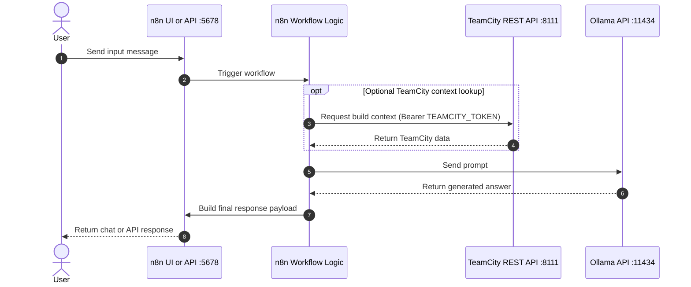
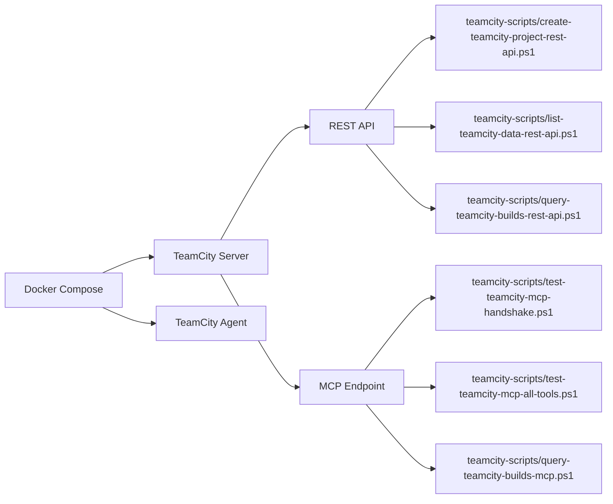
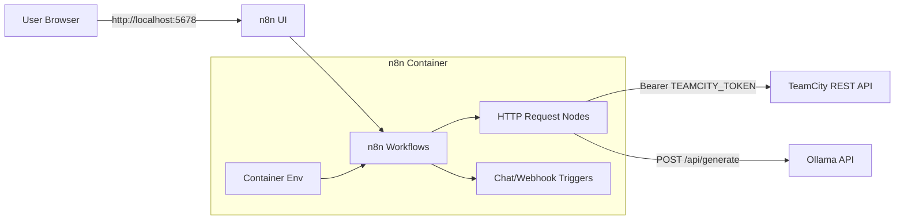
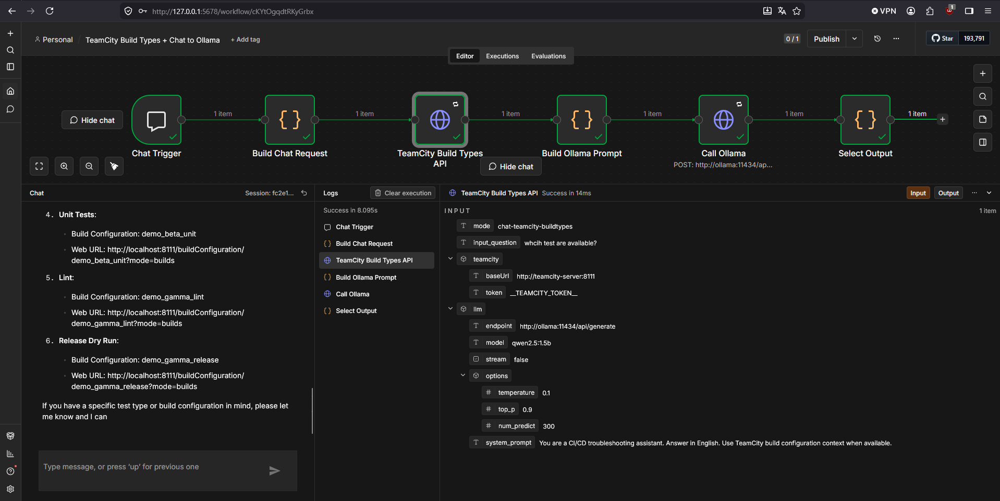
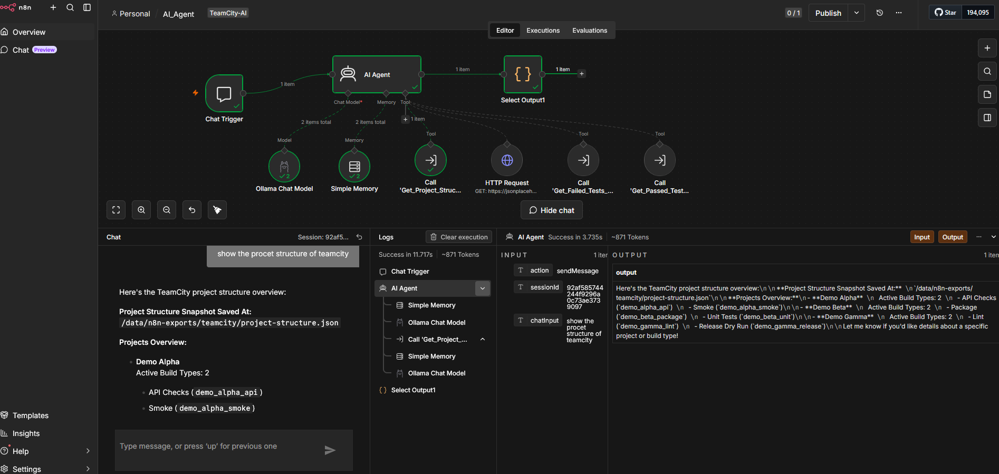

# TeamCity + n8n Docker Lab

Local Docker Compose lab for TeamCity (REST + MCP test flows), n8n (UI + chat/webhooks), and Ollama.

<p align="center">
  
</p>

## Table of Contents

- [Architecture Overview](#architecture-overview)
- [1. TeamCity](#1-teamcity)
  - [1.1 Scope](#11-scope)
  - [1.2 Architecture](#12-architecture)
  - [1.3 Prerequisites](#13-prerequisites)
  - [1.4 Configuration](#14-configuration)
  - [1.5 First Start](#15-first-start)
  - [1.6 Token Setup](#16-token-setup)
  - [1.7 Agent Authorization](#17-agent-authorization)
  - [1.8 Scripts](#18-scripts)
  - [1.9 Reports](#19-reports)
  - [1.10 MCP Raw Data](#110-mcp-raw-data)
  - [1.11 Test Flow](#111-test-flow)
  - [1.12 Persistence](#112-persistence)
  - [1.13 Commands](#113-commands)
  - [1.14 Troubleshooting](#114-troubleshooting)
    - [1.14.6 PowerShell Scripts Blocked](#1146-powershell-scripts-blocked)
- [2. n8n](#2-n8n)
  - [2.1 Scope](#21-scope)
  - [2.2 Architecture](#22-architecture)
  - [2.3 Configuration](#23-configuration)
  - [2.4 First Start](#24-first-start)
  - [2.5 Persistence](#25-persistence)
  - [2.6 Commands](#26-commands)
  - [2.7 Troubleshooting](#27-troubleshooting)
  - [2.8 Custom Chat via Webhook API (Implemented)](#28-custom-chat-via-webhook-api-implemented)
- [3. Ollama](#3-ollama)
  - [3.1 Scope](#31-scope)
  - [3.2 Architecture](#32-architecture)
  - [3.3 Configuration](#33-configuration)
  - [3.3.1 LLM Request Parameters](#331-llm-request-parameters)
  - [3.4 First Start](#34-first-start)
  - [3.5 Persistence](#35-persistence)
  - [3.6 Commands](#36-commands)
  - [3.7 Troubleshooting](#37-troubleshooting)
  - [3.8 Step-by-Step Setup](#38-step-by-step-setup)
- [4. Repository](#4-repository)
  - [4.1 Contents and Structure](#41-contents-and-structure)
  - [4.2 Platform Compatibility](#42-platform-compatibility)
  - [4.3 GitHub Notes](#43-github-notes)
  - [4.4 Legal](#44-legal)

## Architecture Overview

End-to-end runtime flow for a single user request in n8n.



Chronological flow summary:

1. User sends input into the n8n chat or webhook trigger.
2. The workflow logic processes the request.
3. Optional TeamCity REST call for build context (3a) and the Ollama prompt (3b).
4. Ollama returns the generated answer.
5. The response formatter builds the final payload.
6. The response is returned to the user.

## 1. TeamCity

## 1.1 Scope

This section covers TeamCity in this lab:

- local TeamCity server in Docker
- local TeamCity agent in Docker
- REST API testing
- MCP endpoint testing and tool calls
- build logs and report files

## 1.2 Architecture



Containers:

- teamcity-server
- teamcity-agent

## 1.3 Prerequisites

- Docker Desktop is running
- Docker Compose v2 is available
- PowerShell 7 as `pwsh`
- TeamCity initial setup completed once in browser

## 1.4 Configuration

Relevant values in `.env`:

```env
TEAMCITY_HTTP_PORT=8111
TEAMCITY_BASE_URL=http://localhost:8111
TEAMCITY_REPORT_DIR=reports
TEAMCITY_TOKEN=
```

Meaning:

- `TEAMCITY_HTTP_PORT`: published TeamCity UI port
- `TEAMCITY_BASE_URL`: default base URL for scripts
- `TEAMCITY_REPORT_DIR`: target directory for reports
- `TEAMCITY_TOKEN`: personal access token for REST/MCP scripts

## 1.5 First Start

```powershell
docker compose up -d --build
```

Open TeamCity:

- http://localhost:8111

Then complete the TeamCity startup wizard once.

## 1.6 Token Setup

1. Open TeamCity in browser.
2. Open your user profile.
3. Create an access token.
4. Put the token into `.env` as `TEAMCITY_TOKEN`.

## 1.7 Agent Authorization

After first startup, the agent is often `Unauthorized`.

UI path:

1. TeamCity -> Agents -> Unauthorized.
2. Select `docker-agent-01`.
3. Click Authorize.

REST path:

```powershell
Invoke-RestMethod `
  -Method Put `
  -Uri "http://localhost:8111/app/rest/agents/name:docker-agent-01/authorized" `
  -Headers @{ Authorization = "Bearer <TOKEN>"; "Content-Type" = "text/plain" } `
  -Body "true"
```

## 1.8 Scripts

Script overview in `teamcity-scripts/`:

- `create-teamcity-project-rest-api.ps1`: create demo projects and build configs
- `list-teamcity-data-rest-api.ps1`: list projects/buildTypes/queue
- `query-teamcity-builds-rest-api.ps1`: query builds/logs/tests/artifacts/agents via REST
- `query-teamcity-builds-mcp.ps1`: query build data via MCP JSON-RPC
- `test-teamcity-direct-api-variants.ps1`: test direct REST variants
- `test-teamcity-mcp-handshake.ps1`: test MCP handshake
- `test-teamcity-mcp-all-tools.ps1`: discover and call MCP tools
- `read-teamcity-build-logs-rest.ps1`: fetch build logs via REST
- `read-teamcity-build-logs-mcp.ps1`: fetch build logs via MCP

## 1.9 Reports

Default output under `reports/`:

- `teamcity-direct-api-variants-<variant>-*.json`
- `teamcity-mcp-all-tools-*.json`
- `tc-builds-query-rest-api-*.json`
- `tc-builds-query-mcp-*.json`

## 1.10 MCP Raw Data

Important fields in MCP report files:

- Request: `requestHeaders`, `requestBody`
- Response: `responseHeaders`, `responseBodyRaw`

Note: escaped JSON such as `\"` or `\n` is normal in persisted JSON files.

## 1.11 Test Flow

1. Start the stack.
2. Create demo data.
3. Verify data and queue.
4. Run MCP handshake.
5. Test REST variants.
6. Run REST and MCP build queries.
7. Check reports in `reports/`.

Examples:

```powershell
pwsh ./teamcity-scripts/create-teamcity-project-rest-api.ps1
pwsh ./teamcity-scripts/list-teamcity-data-rest-api.ps1
pwsh ./teamcity-scripts/test-teamcity-mcp-handshake.ps1
pwsh ./teamcity-scripts/test-teamcity-direct-api-variants.ps1 -Variant all
pwsh ./teamcity-scripts/query-teamcity-builds-rest-api.ps1
pwsh ./teamcity-scripts/query-teamcity-builds-mcp.ps1
```

## 1.12 Persistence

Persistent volumes:

- `teamcity_data`
- `teamcity_logs`
- `agent_conf`
- `agent_work`
- `agent_temp`
- `agent_system`

Full clean reset:

```powershell
docker compose down -v --remove-orphans
docker compose up -d --build
```

## 1.13 Commands

Start:

```powershell
docker compose up -d --build
```

Status:

```powershell
docker compose ps
```

Logs:

```powershell
docker compose logs -f teamcity-server
docker compose logs --tail=120 teamcity-agent
```

Stop:

```powershell
docker compose down
```

## 1.14 Troubleshooting

### 1.14.1 401 Unauthorized

- Token is missing/invalid/expired
- update `TEAMCITY_TOKEN` in `.env`

### 1.14.2 404 on MCP paths

- MCP plugin is not active or path is wrong
- check plugin status in TeamCity

### 1.14.3 405 on `/app/mcp`

- endpoint exists, but method is not allowed for that request

### 1.14.4 Agent connected but builds do not run

- agent is `Unauthorized`
- authorize agent in TeamCity (see 1.7)

### 1.14.5 TeamCity not reachable

```powershell
docker compose ps
docker compose logs --tail=120 teamcity-server
```

Check port in `.env`:

- `TEAMCITY_HTTP_PORT`

### 1.14.6 PowerShell Scripts Blocked

Error pattern:

- `Script execution is disabled on this system`

One-time run (recommended for quick test):

```powershell
powershell -ExecutionPolicy Bypass -File .\teamcity-scripts\create-teamcity-project-rest-api.ps1
```

Persistent for current user:

```powershell
Set-ExecutionPolicy -Scope CurrentUser -ExecutionPolicy RemoteSigned
```

Then open a new PowerShell session and run normally:

```powershell
.\teamcity-scripts\create-teamcity-project-rest-api.ps1
```

Optional if file is still blocked:

```powershell
Unblock-File .\teamcity-scripts\create-teamcity-project-rest-api.ps1
```

## 2. n8n

## 2.1 Scope

This section covers n8n in this lab:

- local n8n in Docker
- n8n web UI
- local webhook URL configuration
- operation and troubleshooting via Docker logs

## 2.2 Architecture



Container:

- `n8n`

Image build:

- `docker/n8n/Dockerfile`

Compose service:

- `n8n` in `docker-compose.yml`

## 2.3 Configuration

Relevant values in `.env`:

```env
N8N_HTTP_PORT=5678
N8N_BASE_URL=http://localhost:5678
N8N_HOST=localhost
N8N_PROTOCOL=http
N8N_TIMEZONE=Europe/Berlin
N8N_WEBHOOK_URL=http://localhost:5678/
N8N_WEBHOOK_TOKEN=change-this-to-a-long-random-token
N8N_BASIC_AUTH_ACTIVE=false
N8N_BASIC_AUTH_USER=admin
N8N_BASIC_AUTH_PASSWORD=change-this-password
TEAMCITY_TOKEN=
N8N_BLOCK_ENV_ACCESS_IN_NODE=false
N8N_RESTRICT_FILE_ACCESS_TO=/data/n8n-exports
TEAMCITY_AI_STRUCTURE_PATH=/data/n8n-exports/teamcity/structure.json
```

Meaning:

- `N8N_HTTP_PORT`: published host port
- `N8N_BASE_URL`: browser base URL
- `N8N_HOST`: hostname for generated links
- `N8N_PROTOCOL`: protocol (usually `http` locally)
- `N8N_TIMEZONE`: timezone
- `N8N_WEBHOOK_URL`: base for webhook URLs
- `N8N_WEBHOOK_TOKEN`: required shared token for AI_Agent webhook calls (`X-Webhook-Token` header)
- `N8N_BASIC_AUTH_ACTIVE`: optional global n8n Basic Auth switch (`true` or `false`)
- `N8N_BASIC_AUTH_USER`: Basic Auth user when Basic Auth is enabled
- `N8N_BASIC_AUTH_PASSWORD`: Basic Auth password when Basic Auth is enabled
- `TEAMCITY_TOKEN`: TeamCity PAT for API calls from n8n workflows
- `N8N_BLOCK_ENV_ACCESS_IN_NODE`: must be `false` in this lab if nodes access `$env`
- `N8N_RESTRICT_FILE_ACCESS_TO`: allowed paths for file read/write nodes
- `TEAMCITY_AI_STRUCTURE_PATH`: target file path for structure snapshots in workflow `01_TC_Structure_Sync`

Token behavior:

- `.env` values are not copied into workflow JSON during import.
- n8n reads `TEAMCITY_TOKEN` as container env on start/recreate.
- after changing `TEAMCITY_TOKEN`, recreate n8n or old value stays active.

## 2.4 First Start

Open n8n:

- http://localhost:5678

Create the owner account on first open.

## 2.5 Persistence

Persistent volume:

- `n8n_data`

Additional bind mount for local file snapshots:

- `./data/n8n-exports:/data/n8n-exports`

Full clean reset:

```powershell
docker compose down -v --remove-orphans
docker compose up -d --build
```

## 2.6 Commands

n8n logs:

```powershell
docker compose logs -f n8n
```

Rebuild/start n8n:

```powershell
docker compose up -d --build n8n
```

Check port mapping:

```powershell
docker compose port n8n 5678
```

## 2.7 Troubleshooting

### 2.7.1 n8n not reachable

```powershell
docker compose ps
docker compose logs --tail=120 n8n
```

Check in `.env`:

- `N8N_HTTP_PORT`

### 2.7.2 Webhook URL wrong

- set/check `N8N_WEBHOOK_URL` in `.env`
- restart n8n

```powershell
docker compose up -d --build n8n
```

### 2.7.3 TeamCity token changed but n8n still uses old value

- update `TEAMCITY_TOKEN` in `.env` first
- recreate n8n container (no build required)

```powershell
docker compose up -d --force-recreate n8n
```

Note:

- if workflow uses `$env.TEAMCITY_TOKEN`, runtime value is from last recreate.
- set token before recreate.

### 2.7.4 Recreate done but still 401

If you still get `401 Unauthorized` after:

```powershell
docker compose up -d --force-recreate n8n
```

Recreate is usually fine, and the token value itself is invalid/expired/revoked/mis-copied.

Quick check 1 (container token equals `.env` token):

1. Compare local `.env` token and container token by length or hash.
2. If they match, propagation is not the issue.

Quick check 2 (validate token directly against TeamCity API):

```powershell
Invoke-WebRequest -UseBasicParsing -Method Get -Uri http://localhost:8111/app/rest/projects -Headers @{ Authorization = "Bearer <TOKEN>"; Accept = "application/json" }
```

Expected:

- HTTP 200: token valid
- HTTP 401: token invalid/revoked/expired/insufficient rights

## 2.8 Custom Chat via Webhook API (Implemented)

Implemented in workflow:

- `n8n-workflows/Agent/AI_Agent.json`

Behavior:

- Chat Trigger and API Webhook run in parallel and use the same AI Agent flow.
- Chat UI usage continues unchanged.
- Webhook calls receive an HTTP JSON response from `Respond to Webhook`.

Examples:

<p align="center">
  
</p>

<p align="center">
  
</p>

### 2.8.1 Endpoint and Port Mapping

Configured webhook path in the AI Agent workflow:

- `teamcity-ai-agent`

With `N8N_HTTP_PORT=5678` locally:

- test endpoint (while testing in editor):
  - `http://localhost:5678/webhook-test/teamcity-ai-agent`
- production endpoint (active workflow):
  - `http://localhost:5678/webhook/teamcity-ai-agent`

From another container in the same Compose network:

- `http://n8n:5678/webhook/teamcity-ai-agent`

### 2.8.2 Request/Response Contract

Accepted request fields:

- `message` (recommended)
- alternatively: `input`, `chatInput`, or `text`
- optional: `conversationId` or `sessionId`

Example request:

```json
{
  "message": "Zeig mir die fehlgeschlagenen Tests fuer demo_alpha_api",
  "conversationId": "conv-001"
}
```

Example response:

```json
{
  "output": "...",
  "text": "..."
}
```

### 2.8.3 Test Commands (Terminal)

Both URLs at a glance:

- test URL: `http://localhost:5678/webhook-test/teamcity-ai-agent`
- production URL: `http://localhost:5678/webhook/teamcity-ai-agent`

Activation rule:

- test URL requires `Execute workflow` in n8n editor before calling.
- production URL requires workflow to be published/active.

Security rule for this workflow:

- send header `X-Webhook-Token` with the same value as `N8N_WEBHOOK_TOKEN`
- optional: send `Authorization: Bearer <token>` instead

PowerShell prep (run once per terminal session):

```powershell
$token = "change-this-to-a-long-random-token"
$headers = @{ "X-Webhook-Token" = $token }
```

PowerShell (test URL):

```powershell
Invoke-RestMethod -Method Post -Uri "http://localhost:5678/webhook-test/teamcity-ai-agent" -Headers $headers -ContentType "application/json" -Body '{"message":"Zeig mir die fehlgeschlagenen Tests fuer demo_alpha_api"}'
```

PowerShell (production URL):

```powershell
Invoke-RestMethod -Method Post -Uri "http://localhost:5678/webhook/teamcity-ai-agent" -Headers $headers -ContentType "application/json" -Body '{"message":"Zeig mir die fehlgeschlagenen Tests fuer demo_alpha_api"}'
```

PowerShell one-liner (production URL, token from `.env`):

```powershell
$t=(Get-Content .env | Where-Object { $_ -match '^N8N_WEBHOOK_TOKEN=' } | Select-Object -First 1).Split('=',2)[1].Trim(); Invoke-RestMethod -Method Post -Uri "http://localhost:5678/webhook/teamcity-ai-agent" -Headers @{ "X-Webhook-Token" = $t } -ContentType "application/json" -Body '{"message":"Zeig mir die fehlgeschlagenen Tests fuer demo_alpha_api"}'
```

curl prep (store token in variable):

```bash
# Bash / Git Bash / WSL
TOKEN="change-this-to-a-long-random-token"
```

```cmd
:: Windows CMD
set TOKEN=change-this-to-a-long-random-token
```

curl (test URL):

```bash
curl -X POST "http://localhost:5678/webhook-test/teamcity-ai-agent" \
  -H "X-Webhook-Token: $TOKEN" \
  -H "Content-Type: application/json" \
  -d '{"message":"Zeig mir die fehlgeschlagenen Tests fuer demo_alpha_api"}'
```

curl (production URL):

```bash
curl -X POST "http://localhost:5678/webhook/teamcity-ai-agent" \
  -H "X-Webhook-Token: $TOKEN" \
  -H "Content-Type: application/json" \
  -d '{"message":"Zeig mir die fehlgeschlagenen Tests fuer demo_alpha_api"}'
```

curl (Windows CMD, production URL):

```cmd
curl -X POST "http://localhost:5678/webhook/teamcity-ai-agent" ^
  -H "X-Webhook-Token: %TOKEN%" ^
  -H "Content-Type: application/json" ^
  -d "{\"message\":\"Zeig mir die fehlgeschlagenen Tests fuer demo_alpha_api\"}"
```

### 2.8.3.1 PowerShell Output Truncation and Full Response

Behavior:

- PowerShell table view can shorten long string fields with `...`.
- n8n returns the full response; only terminal rendering is shortened.

Show only full `output` text:

PowerShell (test URL):

```powershell
(Invoke-RestMethod -Method Post -Uri "http://localhost:5678/webhook-test/teamcity-ai-agent" -Headers $headers -ContentType "application/json" -Body '{"message":"Zeig mir die fehlgeschlagenen Tests fuer demo_alpha_api"}').output
```

PowerShell (production URL):

```powershell
(Invoke-RestMethod -Method Post -Uri "http://localhost:5678/webhook/teamcity-ai-agent" -Headers $headers -ContentType "application/json" -Body '{"message":"Zeig mir die fehlgeschlagenen Tests fuer demo_alpha_api"}').output
```

Store response in variable and print full fields:

```powershell
$r = Invoke-RestMethod -Method Post -Uri "http://localhost:5678/webhook/teamcity-ai-agent" -Headers $headers -ContentType "application/json" -Body '{"message":"Zeig mir die fehlgeschlagenen Tests fuer demo_alpha_api"}'
$r.output
$r.text
```

Print complete JSON in terminal:

```powershell
Invoke-RestMethod -Method Post -Uri "http://localhost:5678/webhook/teamcity-ai-agent" -Headers $headers -ContentType "application/json" -Body '{"message":"Zeig mir die fehlgeschlagenen Tests fuer demo_alpha_api"}' | ConvertTo-Json -Depth 10
```

Write full output to file:

```powershell
$r = Invoke-RestMethod -Method Post -Uri "http://localhost:5678/webhook/teamcity-ai-agent" -Headers $headers -ContentType "application/json" -Body '{"message":"Zeig mir die fehlgeschlagenen Tests fuer demo_alpha_api"}'
$r.output | Out-File -FilePath "$env:TEMP\n8n-webhook-response.txt" -Encoding utf8
notepad "$env:TEMP\n8n-webhook-response.txt"
```

### 2.8.4 Activation Behavior (Important)

- `webhook-test` works only after clicking `Execute workflow` in the n8n editor and usually for one test call.
- `webhook` works only when the workflow is published/active.
- if webhook was newly added/changed and still returns 404, publish/activate the workflow and restart n8n.

Useful command to publish the AI agent workflow:

```powershell
docker compose exec n8n n8n publish:workflow --id=gfMLTXA2ZfUhJCqJ
docker compose restart n8n
```

### 2.8.5 Operating Rules

- use `webhook-test` for draft/testing runs
- use `webhook` with active workflow for real client integrations
- secure webhook endpoint (token/JWT/reverse proxy), do not expose openly
- keep `N8N_WEBHOOK_URL` aligned with externally reachable URL

## 3. Ollama

## 3.1 Scope

This section covers Ollama in this lab:

- local LLM API in Docker
- configurable model for end-to-end testing (default: `qwen3:8b`)
- access from n8n via internal Docker network

## 3.2 Architecture


Container:

- `ollama`

Image build:

- `docker/ollama/Dockerfile`

Compose service:

- `ollama` in `docker-compose.yml`

Network access from n8n:

- `http://ollama:11434`

## 3.3 Configuration

Relevant values in `.env`:

```env
OLLAMA_HTTP_PORT=11434
OLLAMA_BASE_URL=http://localhost:11434
OLLAMA_MODEL=qwen3:8b
OLLAMA_GPU_REQUEST=all
OLLAMA_GPU_DEVICES=all
OLLAMA_GPU_CAPABILITIES=compute,utility
```

Meaning:

- `OLLAMA_HTTP_PORT`: published host port for Ollama API
- `OLLAMA_BASE_URL`: base URL for host-side API tests
- `OLLAMA_MODEL`: default model used by workflows and API tests
- `OLLAMA_GPU_REQUEST`: Docker GPU request passed to compose (`all` enables GPU request)
- `OLLAMA_GPU_DEVICES`: NVIDIA visible devices inside container (`all` or `none` for CPU-only)
- `OLLAMA_GPU_CAPABILITIES`: requested NVIDIA driver capabilities

## 3.3.1 LLM Request Parameters

These parameters control text generation behavior in Ollama API requests.
They are LLM runtime parameters, not Docker or container runtime settings.

Current usage in this lab (workflow `n8n-workflows/Misc/ollama-smoke-test.json`):

- `model`: `qwen3:8b`
- `stream`: `false`
- `think`: `true` (thinking is returned in raw data, final answer is mapped to chat output)
- `system`: instruction context for the assistant
- `prompt`: user input text
- `options.temperature`: `0.1`
- `options.top_p`: `0.9`
- `options.num_predict`: `512`

Detailed explanation of each current parameter:

- `model`: Selects the exact model tag to run (for example `qwen3:8b`).
  The model defines quality, speed, memory usage, context limits, and supported features.
- `stream`: Controls response delivery mode.
  `false` returns one complete JSON response when generation is finished.
  `true` returns partial chunks incrementally (better latency, more handling complexity).
- `think`: Enables or disables model thinking output (if the model/runtime supports it).
  With `true`, extra reasoning text may be produced (for debug/audit).
  With `false`, the model usually returns only final answer text.
- `system`: High-priority instruction message for behavior, style, language, and safety.
  Use it for stable behavior such as "answer in English" or formatting rules.
- `prompt`: The actual user task or question text.
  This is the main input content the model responds to.
- `options.temperature`: Controls randomness.
  Lower values (for example `0.0` to `0.3`) are more deterministic and stable.
  Higher values (for example `0.7` to `1.0`) are more creative but less predictable.
- `options.top_p`: Nucleus sampling threshold.
  The model samples from tokens whose cumulative probability reaches `top_p`.
  Lower values narrow choices (more focused), higher values broaden choices.
- `options.num_predict`: Maximum number of output tokens to generate.
  If too low, answers can be cut off or final answer may be missing when `think=true`.
  If too high, latency and compute usage increase.

Important optional Ollama generation options you can configure in `options`:

- `seed`: fixed random seed for reproducible outputs.
  Same prompt + same options + same seed increases repeatability.
- `num_ctx`: maximum context window (token budget for prompt + history + output planning).
  Higher values allow longer conversations but require more memory and can reduce speed.
- `repeat_penalty`: discourages repeating the same tokens/phrases.
  Typical range is around `1.05` to `1.2`; too high can hurt fluency.
- `repeat_last_n`: how many recent tokens are considered by repeat penalty.
  `0` disables this behavior; larger values penalize repetition over longer spans.
- `top_k`: limits sampling to the top-k most likely next tokens.
  Lower values are safer/more deterministic; higher values increase diversity.
- `min_p`: minimum probability floor for candidate tokens.
  Can remove very unlikely tokens and stabilize outputs in some setups.
- `num_gpu`: GPU offload control (runtime/model dependent).
  Useful for tuning memory/speed trade-offs on multi-device or constrained systems.
- `num_thread`: CPU thread count used for generation.
  Tune based on host CPU cores and concurrent workloads.
- `stop`: one or more stop sequences that terminate generation when matched.
  Useful for strict output formats and protocol-style prompts.

Practical notes:

- If `think=true`, keep `num_predict` high enough so the model can return both thinking and final answer text.
- If final answer is missing, increase `num_predict` first.
- For fastest and most stable chat replies, set `think=false`.

CPU-only toggle:

- set `OLLAMA_GPU_DEVICES=none`
- recreate Ollama container: `docker compose up -d --force-recreate ollama`

## 3.4 First Start

Start Ollama:

```powershell
docker compose up -d --build ollama
```

Pull model:

```powershell
docker compose exec ollama ollama pull qwen3:8b
```

Quick API check:

```powershell
docker compose exec ollama ollama list
```

## 3.5 Persistence

Persistent volume:

- `ollama_data`

## 3.6 Commands

Logs:

```powershell
docker compose logs -f ollama
```

List models:

```powershell
docker compose exec ollama ollama list
```

Smoke prompt:

```powershell
docker compose exec ollama ollama run qwen3:8b "Respond with OK"
```

n8n workflow for test:

- `n8n-workflows/Misc/ollama-smoke-test.json`

## 3.7 Troubleshooting

### 3.7.1 API not reachable

```powershell
docker compose ps
docker compose logs --tail=120 ollama
```

Check in `.env`:

- `OLLAMA_HTTP_PORT`

### 3.7.2 Model not found

- pull model in container: `docker compose exec ollama ollama pull qwen3:8b`
- run workflow again in n8n

## 3.8 Step-by-Step Setup

1. Start Ollama service:

```powershell
docker compose up -d --build ollama
```

2. Pull model (one-time):

```powershell
docker compose exec ollama ollama pull qwen3:8b
```

3. Verify model:

```powershell
docker compose exec ollama ollama list
```

4. Run a short prompt directly in container:

```powershell
docker compose exec ollama ollama run qwen3:8b "Respond with OK"
```

5. Import and run n8n smoke workflow:

- file: `n8n-workflows/Misc/ollama-smoke-test.json`
- import in n8n and execute Manual Trigger

## 4. Repository

## 4.1 Contents and Structure

- `docker-compose.yml`
- `docker/teamcity-server/Dockerfile`
- `docker/teamcity-agent/Dockerfile`
- `docker/n8n/Dockerfile`
- `docker/ollama/Dockerfile`
- `.env`
- `teamcity-scripts/*.ps1`
- `LICENSE`
- `THIRD_PARTY_NOTICES.md`

## 4.2 Platform Compatibility

Supported:

- Windows
- Linux
- macOS

Recommended shell:

- `pwsh`

## 4.3 GitHub Notes

- `.env` may contain sensitive tokens
- `reports/` may contain sensitive request/response data
- do not commit secrets before publishing

## 4.4 Legal

- License for repository-owned content: MIT (`LICENSE`)
- MIT applies to repository-owned files only (scripts/config/docs), not third-party software
- Third-party software in this lab (including TeamCity, n8n, Ollama) remains under its own licenses and terms
- Third-party notice file: `THIRD_PARTY_NOTICES.md`
- Public Git publishing is generally possible if:
  - no secrets are published
  - third-party notices remain in place
  - third-party license terms are respected
