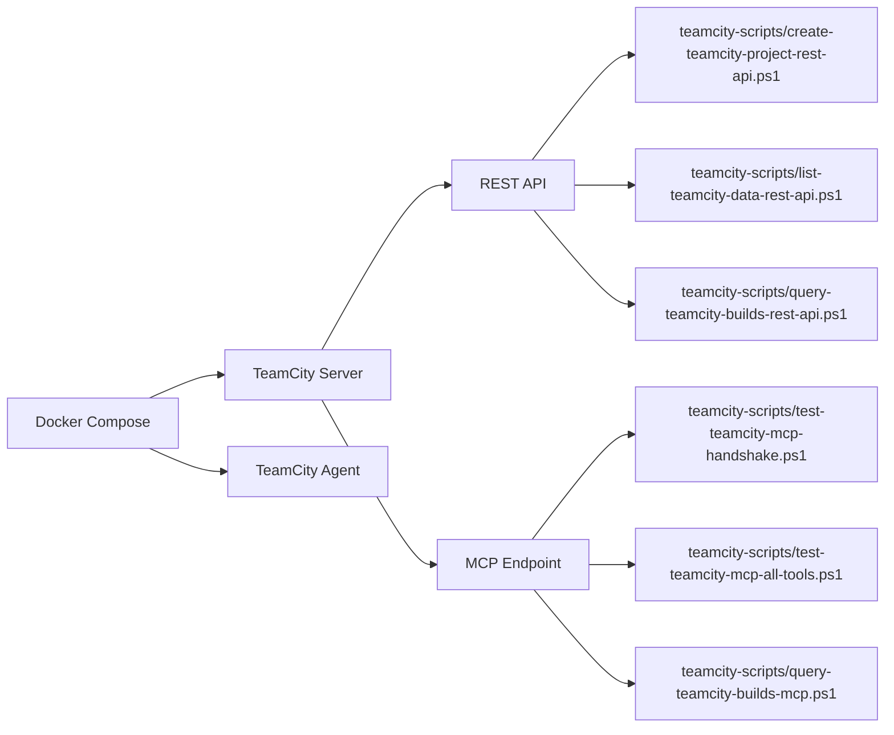

# TeamCity + n8n Docker Lab

Lokale Testumgebung mit Docker Compose für TeamCity (REST + MCP Testflows) und n8n (UI + Webhooks).

## Inhaltsverzeichnis

- [1. TeamCity](#1-teamcity)
- [1.1 Ziel und Umfang](#11-ziel-und-umfang)
- [1.2 TeamCity Architektur](#12-teamcity-architektur)
- [1.3 TeamCity Voraussetzungen](#13-teamcity-voraussetzungen)
- [1.4 TeamCity Konfiguration](#14-teamcity-konfiguration)
- [1.5 TeamCity Erststart](#15-teamcity-erststart)
- [1.6 TeamCity Token Setup](#16-teamcity-token-setup)
- [1.7 TeamCity Agent Autorisierung](#17-teamcity-agent-autorisierung)
- [1.8 TeamCity Skripte](#18-teamcity-skripte)
- [1.9 TeamCity Reports](#19-teamcity-reports)
- [1.10 TeamCity MCP Rohdaten](#110-teamcity-mcp-rohdaten)
- [1.11 TeamCity Testablauf](#111-teamcity-testablauf)
- [1.12 TeamCity Persistenz](#112-teamcity-persistenz)
- [1.13 TeamCity Befehle](#113-teamcity-befehle)
- [1.14 TeamCity Troubleshooting](#114-teamcity-troubleshooting)
- [2. n8n](#2-n8n)
- [2.1 Ziel und Umfang](#21-ziel-und-umfang)
- [2.2 n8n Architektur](#22-n8n-architektur)
- [2.3 n8n Konfiguration](#23-n8n-konfiguration)
- [2.4 n8n Erststart](#24-n8n-erststart)
- [2.5 n8n Persistenz](#25-n8n-persistenz)
- [2.6 n8n Befehle](#26-n8n-befehle)
- [2.7 n8n Troubleshooting](#27-n8n-troubleshooting)
- [3. Ollama](#3-ollama)
- [3.1 Ziel und Umfang](#31-ziel-und-umfang)
- [3.2 Ollama Architektur](#32-ollama-architektur)
- [3.3 Ollama Konfiguration](#33-ollama-konfiguration)
- [3.4 Ollama Erststart](#34-ollama-erststart)
- [3.5 Ollama Persistenz](#35-ollama-persistenz)
- [3.6 Ollama Befehle](#36-ollama-befehle)
- [3.7 Ollama Troubleshooting](#37-ollama-troubleshooting)
- [3.8 Ollama Einrichtung Schritt fuer Schritt](#38-ollama-einrichtung-schritt-fuer-schritt)
- [4. Repository](#4-repository)
- [4.1 Inhalt und Struktur](#41-inhalt-und-struktur)
- [4.2 Plattform Kompatibilitaet](#42-plattform-kompatibilitaet)
- [4.3 Hinweise fuer GitHub](#43-hinweise-fuer-github)
- [4.4 Rechtliches](#44-rechtliches)

## 1. TeamCity

## 1.1 Ziel und Umfang

Dieser Teil deckt alles rund um TeamCity im Lab ab:

- lokaler TeamCity Server in Docker
- lokaler TeamCity Agent in Docker
- REST API Tests
- MCP Endpoint Tests und Tool-Aufrufe
- Build Logs und Report-Dateien

## 1.2 TeamCity Architektur



Container:

- teamcity-server
- teamcity-agent

## 1.3 TeamCity Voraussetzungen

- Docker Desktop laeuft
- Docker Compose v2 verfuegbar
- PowerShell 7 als `pwsh`
- TeamCity Initial-Setup im Browser einmal abgeschlossen

## 1.4 TeamCity Konfiguration

Relevante Werte in `.env`:

```env
TEAMCITY_HTTP_PORT=8111
TEAMCITY_BASE_URL=http://localhost:8111
TEAMCITY_REPORT_DIR=reports
TEAMCITY_TOKEN=
```

Bedeutung:

- `TEAMCITY_HTTP_PORT`: veroeffentlichter TeamCity UI Port
- `TEAMCITY_BASE_URL`: Standard-Basis-URL fuer Skripte
- `TEAMCITY_REPORT_DIR`: Zielordner fuer Reports
- `TEAMCITY_TOKEN`: Personal Access Token fuer REST/MCP Skripte

## 1.5 TeamCity Erststart

```powershell
docker compose up -d --build
```

TeamCity oeffnen:

- http://localhost:8111

Danach den TeamCity Startup Wizard einmal abschliessen.

## 1.6 TeamCity Token Setup

1. TeamCity im Browser oeffnen.
2. Benutzerprofil oeffnen.
3. Access Token erstellen.
4. Token in `.env` als `TEAMCITY_TOKEN` eintragen.

## 1.7 TeamCity Agent Autorisierung

Nach dem ersten Start ist der Agent oft `Unauthorized`.

UI Weg:

1. TeamCity -> Agents -> Unauthorized.
2. `docker-agent-01` waehlen.
3. Authorize klicken.

REST Weg:

```powershell
Invoke-RestMethod `
  -Method Put `
  -Uri "http://localhost:8111/app/rest/agents/name:docker-agent-01/authorized" `
  -Headers @{ Authorization = "Bearer <TOKEN>"; "Content-Type" = "text/plain" } `
  -Body "true"
```

## 1.8 TeamCity Skripte

Script-Uebersicht in `teamcity-scripts/`:

- `create-teamcity-project-rest-api.ps1`: Demo-Projekte/Build-Konfigurationen anlegen
- `list-teamcity-data-rest-api.ps1`: Projekte/BuildTypes/Queue listen
- `query-teamcity-builds-rest-api.ps1`: Builds/Logs/Tests/Artifacts/Agents via REST
- `query-teamcity-builds-mcp.ps1`: Build-Daten via MCP JSON-RPC
- `test-teamcity-direct-api-variants.ps1`: direkte REST Varianten testen
- `test-teamcity-mcp-handshake.ps1`: MCP Handshake testen
- `test-teamcity-mcp-all-tools.ps1`: MCP Tools discovern und aufrufen
- `read-teamcity-build-logs-rest.ps1`: Build Logs via REST ziehen
- `read-teamcity-build-logs-mcp.ps1`: Build Logs via MCP ziehen

## 1.9 TeamCity Reports

Standardmaessig unter `reports/`:

- `teamcity-direct-api-variants-<variant>-*.json`
- `teamcity-mcp-all-tools-*.json`
- `tc-builds-query-rest-api-*.json`
- `tc-builds-query-mcp-*.json`

## 1.10 TeamCity MCP Rohdaten

Wichtige Felder in MCP Report-Dateien:

- Request: `requestHeaders`, `requestBody`
- Response: `responseHeaders`, `responseBodyRaw`

Hinweis: JSON Escaping wie `\"` oder `\n` ist normal fuer gespeicherte JSON-Dateien.

## 1.11 TeamCity Testablauf

1. Stack starten.
2. Demo-Daten erzeugen.
3. Daten und Queue pruefen.
4. MCP Handshake laufen lassen.
5. REST Varianten testen.
6. REST und MCP Build Queries ausfuehren.
7. Reports in `reports/` pruefen.

Beispiele:

```powershell
pwsh ./teamcity-scripts/create-teamcity-project-rest-api.ps1
pwsh ./teamcity-scripts/list-teamcity-data-rest-api.ps1
pwsh ./teamcity-scripts/test-teamcity-mcp-handshake.ps1
pwsh ./teamcity-scripts/test-teamcity-direct-api-variants.ps1 -Variant all
pwsh ./teamcity-scripts/query-teamcity-builds-rest-api.ps1
pwsh ./teamcity-scripts/query-teamcity-builds-mcp.ps1
```

## 1.12 TeamCity Persistenz

Persistente Volumes:

- `teamcity_data`
- `teamcity_logs`
- `agent_conf`
- `agent_work`
- `agent_temp`
- `agent_system`

Vollstaendig sauberer Reset:

```powershell
docker compose down -v --remove-orphans
docker compose up -d --build
```

## 1.13 TeamCity Befehle

Start:

```powershell
docker compose up -d --build
```

Status:

```powershell
docker compose ps
```

Logs:

```powershell
docker compose logs -f teamcity-server
docker compose logs --tail=120 teamcity-agent
```

Stop:

```powershell
docker compose down
```

## 1.14 TeamCity Troubleshooting

### 1.14.1 401 Unauthorized

- Token fehlt/ungueltig/abgelaufen
- `TEAMCITY_TOKEN` in `.env` aktualisieren

### 1.14.2 404 auf MCP Pfaden

- MCP Plugin nicht aktiv oder falscher Pfad
- Plugin in TeamCity pruefen

### 1.14.3 405 auf `/app/mcp`

- Endpoint existiert, Methodenprobe war fuer diesen Request nicht erlaubt

### 1.14.4 Agent verbunden, aber Builds laufen nicht

- Agent ist `Unauthorized`
- Agent in TeamCity autorisieren (siehe 1.7)

### 1.14.5 TeamCity nicht erreichbar

```powershell
docker compose ps
docker compose logs --tail=120 teamcity-server
```

Port in `.env` pruefen:

- `TEAMCITY_HTTP_PORT`

## 2. n8n

## 2.1 Ziel und Umfang

Dieser Teil deckt alles rund um n8n im Lab ab:

- lokales n8n in Docker
- n8n Web UI
- lokale Webhook URL Konfiguration
- Betrieb und Fehleranalyse per Docker Logs

## 2.2 n8n Architektur

Container:

- `n8n`

Image Build:

- `docker/n8n/Dockerfile`

Compose Service:

- `n8n` in `docker-compose.yml`

## 2.3 n8n Konfiguration

Relevante Werte in `.env`:

```env
N8N_HTTP_PORT=5678
N8N_BASE_URL=http://localhost:5678
N8N_HOST=localhost
N8N_PROTOCOL=http
N8N_TIMEZONE=Europe/Berlin
N8N_WEBHOOK_URL=http://localhost:5678/
```

Bedeutung:

- `N8N_HTTP_PORT`: veroeffentlichter Host-Port
- `N8N_BASE_URL`: Basis-URL fuer Browser Zugriff
- `N8N_HOST`: Hostname fuer URL-Generierung
- `N8N_PROTOCOL`: Protokoll (lokal meist `http`)
- `N8N_TIMEZONE`: Zeitzone
- `N8N_WEBHOOK_URL`: Basis fuer Webhook-URLs

## 2.4 n8n Erststart

n8n oeffnen:

- http://localhost:5678

Beim ersten Oeffnen den Owner Account anlegen.

## 2.5 n8n Persistenz

Persistentes Volume:

- `n8n_data`

Vollstaendig sauberer Reset:

```powershell
docker compose down -v --remove-orphans
docker compose up -d --build
```

## 2.6 n8n Befehle

n8n Logs:

```powershell
docker compose logs -f n8n
```

n8n neu bauen/starten:

```powershell
docker compose up -d --build n8n
```

Port Mapping pruefen:

```powershell
docker compose port n8n 5678
```

## 2.7 n8n Troubleshooting

### 2.7.1 n8n nicht erreichbar

```powershell
docker compose ps
docker compose logs --tail=120 n8n
```

Port in `.env` pruefen:

- `N8N_HTTP_PORT`

### 2.7.2 Webhook URL falsch

- `N8N_WEBHOOK_URL` in `.env` setzen/pruefen
- n8n neu starten

```powershell
docker compose up -d --build n8n
```

## 3. Ollama

## 3.1 Ziel und Umfang

Dieser Teil deckt alles rund um Ollama im Lab ab:

- lokale LLM API in Docker
- minimales Modell fuer End-to-End Tests
- Zugriff aus n8n ueber internes Docker-Netzwerk

## 3.2 Ollama Architektur

Container:

- `ollama`

Image Build:

- `docker/ollama/Dockerfile`

Compose Service:

- `ollama` in `docker-compose.yml`

Netzwerk-Zugriff aus n8n:

- `http://ollama:11434`

## 3.3 Ollama Konfiguration

Relevante Werte in `.env`:

```env
OLLAMA_HTTP_PORT=11434
OLLAMA_BASE_URL=http://localhost:11434
OLLAMA_MODEL=tinyllama
```

Bedeutung:

- `OLLAMA_HTTP_PORT`: veroeffentlichter Host-Port der Ollama API
- `OLLAMA_BASE_URL`: Basis-URL fuer Host-seitige API Tests
- `OLLAMA_MODEL`: minimales Testmodell fuer Workflows

## 3.4 Ollama Erststart

Ollama starten:

```powershell
docker compose up -d --build ollama
```

Minimales Modell ziehen:

```powershell
docker compose exec ollama ollama pull tinyllama
```

API kurz pruefen:

```powershell
docker compose exec ollama ollama list
```

## 3.5 Ollama Persistenz

Persistentes Volume:

- `ollama_data`

## 3.6 Ollama Befehle

Ollama Logs:

```powershell
docker compose logs -f ollama
```

Modelle anzeigen:

```powershell
docker compose exec ollama ollama list
```

Smoke-Test Prompt:

```powershell
docker compose exec ollama ollama run tinyllama "Antworte mit OK"
```

n8n Workflow-Datei fuer Test:

- `n8n-workflows/ollama-smoke-test.json`

## 3.7 Ollama Troubleshooting

### 3.7.1 API nicht erreichbar

```powershell
docker compose ps
docker compose logs --tail=120 ollama
```

Port in `.env` pruefen:

- `OLLAMA_HTTP_PORT`

### 3.7.2 Modell nicht gefunden

- Modell im Container ziehen: `docker compose exec ollama ollama pull tinyllama`
- Danach Workflow in n8n erneut ausfuehren

## 3.8 Ollama Einrichtung Schritt fuer Schritt

1. Ollama Service starten:

```powershell
docker compose up -d --build ollama
```

2. Minimales Modell laden (einmalig):

```powershell
docker compose exec ollama ollama pull tinyllama
```

3. Modell-Download pruefen:

```powershell
docker compose exec ollama ollama list
```

4. Kurzen Prompt-Test direkt im Container ausfuehren:

```powershell
docker compose exec ollama ollama run tinyllama "Antworte mit OK"
```

5. n8n-Testworkflow importieren und starten:

- Datei: `n8n-workflows/ollama-smoke-test.json`
- In n8n importieren und den Manual Trigger ausfuehren

## 4. Repository

## 4.1 Inhalt und Struktur

- `docker-compose.yml`
- `docker/teamcity-server/Dockerfile`
- `docker/teamcity-agent/Dockerfile`
- `docker/n8n/Dockerfile`
- `docker/ollama/Dockerfile`
- `.env`
- `teamcity-scripts/*.ps1`
- `LICENSE`
- `THIRD_PARTY_NOTICES.md`

## 4.2 Plattform Kompatibilitaet

Unterstuetzt:

- Windows
- Linux
- macOS

Empfohlene Shell:

- `pwsh`

## 4.3 Hinweise fuer GitHub

- `.env` kann sensible Tokens enthalten
- `reports/` kann sensible Request/Response Daten enthalten
- vor Veroeffentlichung keine Secrets committen

## 4.4 Rechtliches

- Lizenz fuer Repo-Inhalte: MIT (`LICENSE`)
- TeamCity ist Drittsoftware von JetBrains
- Hinweise zu Drittsoftware: `THIRD_PARTY_NOTICES.md`
