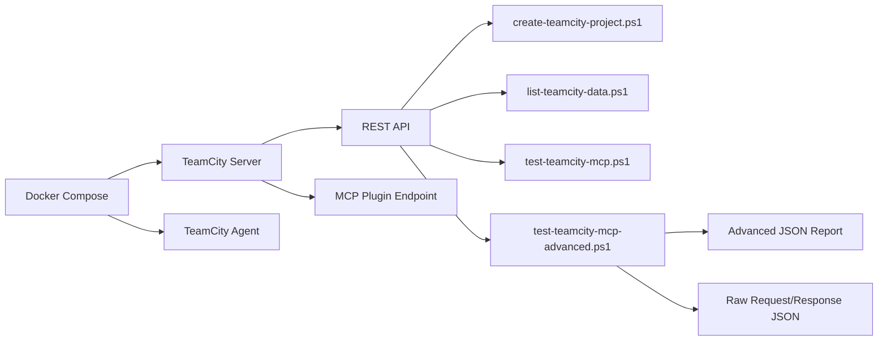
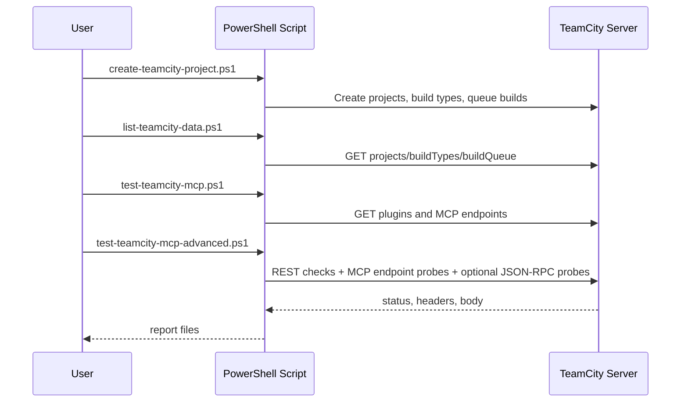

# TeamCity Docker Setup with MCP Test Data

A local TeamCity test environment using Docker Compose, plus PowerShell scripts for creating sample projects, listing TeamCity data, and capturing MCP-related request/response traffic.

## Table of Contents

- [1. Purpose](#1-purpose)
- [2. What This Repository Contains](#2-what-this-repository-contains)
- [3. Architecture](#3-architecture)
- [4. Requirements](#4-requirements)
- [5. Platform Compatibility](#5-platform-compatibility)
- [6. Configuration](#6-configuration)
- [7. First Start](#7-first-start)
- [8. Token Setup in TeamCity](#8-token-setup-in-teamcity)
- [8a. Agent Authorization](#8a-agent-authorization)
- [9. Scripts](#9-scripts)
- [10. Output Files and Reports](#10-output-files-and-reports)
- [11. What the Raw MCP Files Actually Contain](#11-what-the-raw-mcp-files-actually-contain)
- [12. Recommended Test Flow](#12-recommended-test-flow)
- [13. Docker Persistence](#13-docker-persistence)
- [14. Useful Commands](#14-useful-commands)
- [15. Public GitHub Repository Notes](#15-public-github-repository-notes)
- [16. Legal Notice and Third-Party Terms](#16-legal-notice-and-third-party-terms)
- [17. Troubleshooting](#17-troubleshooting)

## 1. Purpose

This repository is designed as a learning and testing project for:

- running TeamCity locally in Docker
- creating multiple TeamCity projects and build configurations quickly
- testing TeamCity's MCP plugin availability
- capturing request and response data sent between the script and the TeamCity server

The goal is to have a reproducible local setup that can be used to inspect TeamCity REST and MCP-related behavior.

## 2. What This Repository Contains

- [docker-compose.yml](docker-compose.yml): TeamCity server and agent services
- [docker/teamcity-server/Dockerfile](docker/teamcity-server/Dockerfile): TeamCity server image wrapper
- [docker/teamcity-agent/Dockerfile](docker/teamcity-agent/Dockerfile): TeamCity agent image wrapper
- [.env](.env): local runtime configuration
- [scripts/create-teamcity-project.ps1](scripts/create-teamcity-project.ps1): creates sample TeamCity data or one single project
- [scripts/list-teamcity-data.ps1](scripts/list-teamcity-data.ps1): lists projects, build configurations, and queue entries
- [scripts/test-teamcity-mcp.ps1](scripts/test-teamcity-mcp.ps1): simple MCP availability smoke test
- [scripts/test-teamcity-mcp-advanced.ps1](scripts/test-teamcity-mcp-advanced.ps1): advanced MCP and REST diagnostics with report generation
- [LICENSE](LICENSE): repository license

## 3. Architecture





## 4. Requirements

- Docker Desktop installed and running
- Docker Compose v2 available
- PowerShell 7 available as `pwsh`
- initial TeamCity setup completed once in the browser

## 5. Platform Compatibility

The scripts are written in PowerShell and are intended to work across:

- Windows
- Linux
- macOS

Recommended shell on all platforms:

```text
pwsh
```

If `pwsh` is not installed yet, install PowerShell 7 first.

Typical examples:

- Windows: install PowerShell 7 and run it as `pwsh`
- Linux: install the `powershell` package for your distribution and run `pwsh`
- macOS: install PowerShell 7 and run `pwsh`

Recommended usage:

- use `pwsh` on Windows as well
- use the same commands on Linux and macOS
- treat Windows PowerShell 5.1 as optional, not as the primary shell
- run all documented script commands from the repository root unless noted otherwise

Examples:

Windows:

```powershell
pwsh ./scripts/create-teamcity-project.ps1
```

Linux or macOS:

```bash
pwsh ./scripts/create-teamcity-project.ps1
```

If script execution is blocked on Windows, run this once per session:

```powershell
Set-ExecutionPolicy -Scope Process -ExecutionPolicy Bypass -Force
```

On Linux and macOS, `Set-ExecutionPolicy` is usually not needed, but `pwsh` must be installed.

## 6. Configuration

The repository uses [.env](.env) for shared defaults.

Current supported values:

```env
TEAMCITY_HTTP_PORT=8111
TEAMCITY_BASE_URL=http://localhost:8111
TEAMCITY_DEFAULT_PROJECT_ID=demo_project
TEAMCITY_DEFAULT_PROJECT_NAME=Demo Project
TEAMCITY_REPORT_DIR=
TEAMCITY_TOKEN=your_token_here
```

What each value means:

- `TEAMCITY_HTTP_PORT`: published TeamCity web port on the host
- `TEAMCITY_BASE_URL`: default base URL used by all PowerShell scripts when `-BaseUrl` is omitted
- `TEAMCITY_DEFAULT_PROJECT_ID`: default project ID for single-project mode
- `TEAMCITY_DEFAULT_PROJECT_NAME`: default project name for single-project mode
- `TEAMCITY_REPORT_DIR`: optional output directory for generated reports; if empty, the repository root is used
- `TEAMCITY_TOKEN`: TeamCity access token used by the scripts

All scripts first use explicitly passed parameters, then environment variables, then `.env` values.

## 7. First Start

Run all commands from the repository root:

```text
teamcity-test-server/
```

Start the stack:

```powershell
docker compose up -d --build
```

Open TeamCity:

`http://localhost:8111`

Complete the TeamCity startup wizard once.

## 8. Token Setup in TeamCity

To create the token used by the scripts:

1. Open TeamCity in the browser.
2. Click your user profile.
3. Open the profile or access token section.
4. Create a new access token.
5. Copy the token immediately.
6. Store it in [.env](.env) as `TEAMCITY_TOKEN=...`

Note: the token may not be shown again in full after creation.

## 8a. Agent Authorization

After the first start, the TeamCity agent (`docker-agent-01`) connects to the server but is initially **Unauthorized**.
Builds will stay in the queue and never be picked up until the agent is authorized.

### Option A – Authorize manually in the UI (recommended for first setup)

1. Open TeamCity in the browser: `http://localhost:8111`
2. Go to **Agents** in the top navigation.
3. Select the tab **Unauthorized**.
4. Click `docker-agent-01`.
5. Click **Authorize**.

The agent moves to **Connected & Authorized** and starts picking up queued builds immediately.

### Option B – Authorize via REST API (e.g. from a script or terminal)

Replace `<TOKEN>` with your TeamCity token from [.env](.env):

```powershell
Invoke-RestMethod `
  -Method Put `
  -Uri "http://localhost:8111/app/rest/agents/name:docker-agent-01/authorized" `
  -Headers @{ Authorization = "Bearer <TOKEN>"; "Content-Type" = "text/plain" } `
  -Body "true"
```

Or with `curl`:

```bash
curl -s -X PUT \
  -H "Authorization: Bearer <TOKEN>" \
  -H "Content-Type: text/plain" \
  -d "true" \
  http://localhost:8111/app/rest/agents/name:docker-agent-01/authorized
```

A `204 No Content` response means the agent is now authorized.

### When to re-authorize

Authorization is stored in the `agent_conf` Docker volume and survives container restarts.
You only need to authorize again after running `docker compose down -v` (full volume wipe).

## 9. Scripts

If PowerShell blocks script execution, allow it for the current session:

```powershell
Set-ExecutionPolicy -Scope Process -ExecutionPolicy Bypass -Force
```

### 9.1 create-teamcity-project.ps1

File: [scripts/create-teamcity-project.ps1](scripts/create-teamcity-project.ps1)

Default behavior:

```powershell
pwsh ./scripts/create-teamcity-project.ps1
```

By default this script creates full demo test data and queues builds automatically.

Default output created by this script:

- 3 projects: `demo_alpha`, `demo_beta`, `demo_gamma`
- 6 build configurations total
- 6 queued builds

Single project mode:

```powershell
pwsh ./scripts/create-teamcity-project.ps1 -SingleProject -ProjectId "demo_project" -ProjectName "Demo Project"
```

Explicit test-data mode:

```powershell
pwsh ./scripts/create-teamcity-project.ps1 -CreateTestData
```

Explicit test-data mode with build queue:

```powershell
pwsh ./scripts/create-teamcity-project.ps1 -CreateTestData -QueueBuilds
```

What the script does internally:

- reads `TEAMCITY_TOKEN` and `TEAMCITY_BASE_URL`
- creates missing TeamCity projects
- creates missing build configurations
- optionally queues builds
- skips objects that already exist

### 9.2 list-teamcity-data.ps1

File: [scripts/list-teamcity-data.ps1](scripts/list-teamcity-data.ps1)

Run:

```powershell
pwsh ./scripts/list-teamcity-data.ps1
```

What it does:

- calls TeamCity REST API
- lists current projects
- lists current build configurations
- lists current build queue count

What it prints:

- total project count
- total build configuration count
- total queued build count
- a short project list
- a short build configuration list

This script is REST-only. It does not test MCP directly.

### 9.3 test-teamcity-mcp.ps1

File: [scripts/test-teamcity-mcp.ps1](scripts/test-teamcity-mcp.ps1)

Run:

```powershell
pwsh ./scripts/test-teamcity-mcp.ps1
```

What it does:

- checks the TeamCity plugin list through REST
- looks for MCP-related plugin data
- probes a few MCP-related endpoint paths

What the result means:

- `200` on plugin list: TeamCity is reachable and responding
- MCP text found: the MCP plugin is visible in TeamCity
- `405` on `/app/mcp`: the endpoint exists, but the probe used a method the endpoint does not accept for that request
- `404` on `/app/mcp/sse` or `/mcp`: those tested paths are not available in this setup

This is the quick smoke test.

### 9.4 test-teamcity-mcp-advanced.ps1

File: [scripts/test-teamcity-mcp-advanced.ps1](scripts/test-teamcity-mcp-advanced.ps1)

Run:

```powershell
pwsh ./scripts/test-teamcity-mcp-advanced.ps1
```

Default behavior:

- performs REST inventory checks
- performs MCP endpoint checks
- enables raw body capture automatically if no explicit output mode is selected
- writes two reports by default:
  - an advanced analysis report
  - a raw request/response report

Optional JSON-RPC probe mode:

```powershell
pwsh ./scripts/test-teamcity-mcp-advanced.ps1 -JsonRpcProbes
```

Optional NDJSON trace mode:

```powershell
pwsh ./scripts/test-teamcity-mcp-advanced.ps1 -JsonRpcProbes -NdjsonTrace
```

Skip REST inventory and test only MCP endpoints:

```powershell
pwsh ./scripts/test-teamcity-mcp-advanced.ps1 -SkipRestInventory
```

Explicit report paths:

```powershell
pwsh ./scripts/test-teamcity-mcp-advanced.ps1 -JsonRpcProbes -ReportPath "./mcp-report.json" -RawJsonPath "./mcp-server-raw.json" -NdjsonPath "./mcp-trace.ndjson"
```

What it checks:

- `GET /app/rest/projects`
- `GET /app/rest/buildTypes`
- `GET /app/rest/buildQueue`
- `GET /app/rest/server/plugins`
- `GET` and `OPTIONS` against MCP-related endpoints
- optional `POST` JSON-RPC probes such as `initialize` and `tools/list`

## 10. Output Files and Reports

### 9.1 Advanced report

Pattern:

- `mcp-advanced-report-*.json`

Purpose:

- human-readable diagnostic file
- combines REST inventory, MCP endpoint checks, and optional JSON-RPC probe results

Important top-level fields:

- `generatedAt`
- `baseUrl`
- `tokenDetected`
- `rawBodiesEnabled`
- `ndjsonTraceEnabled`
- `rawJsonOutputEnabled`
- `restInventory`
- `restSummary`
- `mcpEndpointChecks`
- `jsonRpcProbes`

Important fields inside each inventory/check record:

- `timestamp`
- `method`
- `url`
- `requestHeaders`
- `requestBody`
- `status`
- `statusText`
- `contentType`
- `allow`
- `responseHeaders`
- `bodyLength`
- `bodySnippet`
- `bodyRaw`
- `responseBodyRaw`
- `ok`
- `error`

### 9.2 Raw request/response report

Pattern:

- `mcp-server-raw-*.json`

Purpose:

- stores request and response exchanges as directly as possible
- intended for inspecting what the script sent and what TeamCity returned

Structure:

- `generatedAt`
- `baseUrl`
- `tokenDetected`
- `exchanges`

Each `exchange` contains:

- `category`
- `request`
- `response`

Each `request` contains:

- `timestamp`
- `method`
- `url`
- `headers`
- `body`

Each `response` contains:

- `status`
- `statusText`
- `headers`
- `body`

### 9.3 NDJSON trace

Pattern:

- `mcp-advanced-trace-*.ndjson`

Purpose:

- one JSON object per line
- useful for later machine processing, grepping, or log-style analysis

## 11. What the Raw MCP Files Actually Contain

This is the most important distinction in this repository.

### 10.1 What is captured exactly

The raw files capture:

- the HTTP request sent by the script
- the HTTP response returned by TeamCity

That includes:

- method
- URL
- headers
- request body
- response status
- response headers
- response body

### 10.2 What is considered original

For this repository, the raw report is intended to preserve the request and response content exactly as used in the HTTP exchange.

That means:

- the request body is stored as sent
- the response body is stored as returned
- the authorization header is stored as sent
- response headers are stored as returned

### 10.3 Why the JSON file still looks escaped

The file itself is a JSON document.

So characters may appear escaped, for example:

- `\"`
- `\u003c`
- `\n`

This is normal JSON encoding of the saved file.
It does not mean the request or response content was semantically changed.

### 10.4 Which fields matter most

If you want the most direct request/response view, focus on:

- raw report file: `request.headers`, `request.body`, `response.headers`, `response.body`
- advanced report file: `requestHeaders`, `requestBody`, `responseHeaders`, `responseBodyRaw`

### 10.5 bodySnippet vs bodyRaw vs responseBodyRaw

In the advanced report:

- `bodySnippet`: currently stores the full response body in this project
- `bodyRaw`: stores the same body when raw body capture is enabled
- `responseBodyRaw`: stores the response body as returned by the server

For practical inspection, `responseBodyRaw` is the clearest field to treat as the captured server response body.

## 12. Recommended Test Flow

1. Start TeamCity:

```powershell
docker compose up -d --build
```

2. Seed sample TeamCity data:

```powershell
pwsh ./scripts/create-teamcity-project.ps1
```

3. Verify projects, build types, and queue entries:

```powershell
pwsh ./scripts/list-teamcity-data.ps1
```

4. Run the quick MCP test:

```powershell
pwsh ./scripts/test-teamcity-mcp.ps1
```

5. Run the advanced report generator:

```powershell
pwsh ./scripts/test-teamcity-mcp-advanced.ps1
```

6. Inspect the generated files:

- `mcp-advanced-report-*.json`
- `mcp-server-raw-*.json`
- optionally `mcp-advanced-trace-*.ndjson`

## 13. Docker Persistence

Docker named volumes are used:

- `teamcity_data`
- `teamcity_logs`
- `agent_conf`
- `agent_work`
- `agent_temp`
- `agent_system`

These survive `docker compose down`.
A full clean reinstall requires removing volumes too:

```powershell
docker compose down -v
```

## 14. Useful Commands

Start:

```powershell
docker compose up -d --build
```

Status:

```powershell
docker compose ps
```

Server logs:

```powershell
docker compose logs -f teamcity-server
```

Agent logs:

```powershell
docker compose logs --tail=120 teamcity-agent
```

Stop:

```powershell
docker compose down
```

Full clean reinstall:

```powershell
docker compose down -v --remove-orphans
docker compose up -d --build
```

## 15. Public GitHub Repository Notes

This repository can generally be published as a public GitHub repository as a learning project.

Important distinction:

- this repository contains your own setup, scripts, and documentation
- TeamCity itself is pulled from official JetBrains Docker images at runtime

That means this repository is primarily configuration and test tooling, not a redistribution of TeamCity binaries by itself.

About the license file:

- [LICENSE](LICENSE) is the license for this repository
- it is not a TeamCity license file
- you do not need to add a TeamCity product license file to publish this repository

Current repository behavior to be aware of:

- `.env` may contain a real TeamCity token
- generated raw report files may contain real authorization headers and raw request/response content
- this is intentional in this project for test and learning purposes

If you keep the repository public in this form, you are intentionally publishing test credentials and raw traffic captures.
That is a security decision, not a documentation requirement.

For legal scope and third-party details, see section 16 and [THIRD_PARTY_NOTICES.md](THIRD_PARTY_NOTICES.md).

## 16. Legal Notice and Third-Party Terms

This repository is licensed under the MIT License.

Scope clarification:

- the MIT License in [LICENSE](LICENSE) applies to this repository's own content only (scripts, Docker Compose setup, and documentation)
- TeamCity is third-party software provided by JetBrains and is used under JetBrains terms and licenses
- this repository does not claim ownership of TeamCity

Trademark and affiliation notice:

- TeamCity is a trademark of JetBrains s.r.o.
- this repository is an independent community project and is not affiliated with, endorsed by, or sponsored by JetBrains

Third-party notices:

- see [THIRD_PARTY_NOTICES.md](THIRD_PARTY_NOTICES.md)

This section is for transparency and is not legal advice.

## 17. Troubleshooting

### 17.1 401 Unauthorized

Cause:

- missing token
- invalid token
- expired token

Fix:

1. Create a new TeamCity access token.
2. Update `TEAMCITY_TOKEN` in [.env](.env).
3. Run the script again.

### 17.2 404 on MCP paths

Cause:

- wrong endpoint path
- MCP plugin not active

Fix:

1. Check TeamCity Administration -> Plugins.
2. Verify the MCP Server plugin is active.
3. Run [scripts/test-teamcity-mcp.ps1](scripts/test-teamcity-mcp.ps1) again.

### 17.3 405 on `/app/mcp`

Meaning:

- the endpoint exists
- the endpoint does not accept the probe request method for that specific test

In this repository, a `405` on `/app/mcp` is generally treated as evidence that the endpoint exists.

### 17.4 PowerShell execution policy blocks scripts

Typical error on Windows:

- `File <path> cannot be loaded because running scripts is disabled on this system.`
- `... because script execution is disabled on this system.`

Meaning:

- PowerShell execution policy is preventing local script execution

Run once per session:

```powershell
Set-ExecutionPolicy -Scope Process -ExecutionPolicy Bypass -Force
```

Then run the script again in the same terminal.

### 17.5 TeamCity not reachable

Check:

```powershell
docker compose ps
docker compose logs --tail=120 teamcity-server
```

Common fix:

- change `TEAMCITY_HTTP_PORT` in [.env](.env)
- restart Docker Compose

### 17.6 Queue stays empty or stuck

Check:

- whether the TeamCity agent is connected
- whether projects and build configurations were created
- whether queue entries exist via [scripts/list-teamcity-data.ps1](scripts/list-teamcity-data.ps1)

Agent log check:

```powershell
docker compose logs --tail=120 teamcity-agent
```

### 17.7 Agent is connected but builds are never picked up

Cause:

- the agent is **Unauthorized** — this is the default state after the first start

Fix A (UI):

1. Open TeamCity → **Agents** → tab **Unauthorized**.
2. Click `docker-agent-01` → **Authorize**.

Fix B (REST API):

```powershell
Invoke-RestMethod `
  -Method Put `
  -Uri "http://localhost:8111/app/rest/agents/name:docker-agent-01/authorized" `
  -Headers @{ Authorization = "Bearer <TOKEN>"; "Content-Type" = "text/plain" } `
  -Body "true"
```

See [section 8a](#8a-agent-authorization) for the full explanation.
